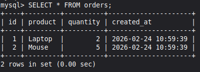
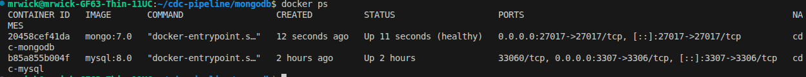
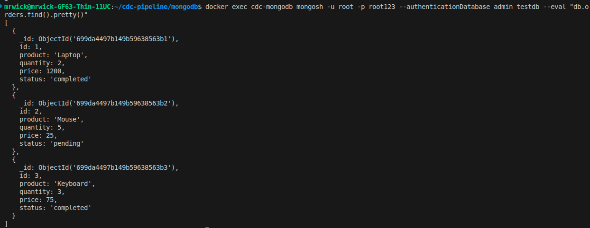
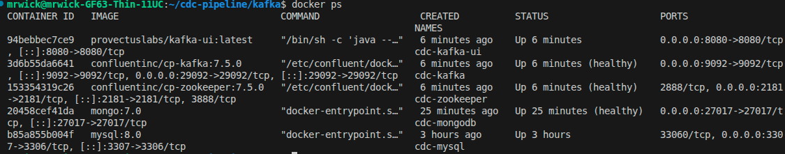
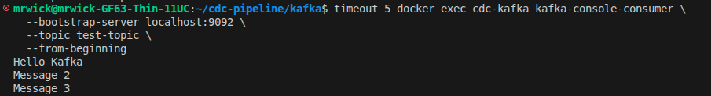
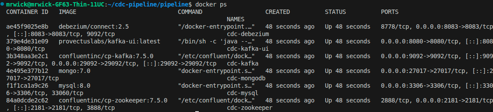
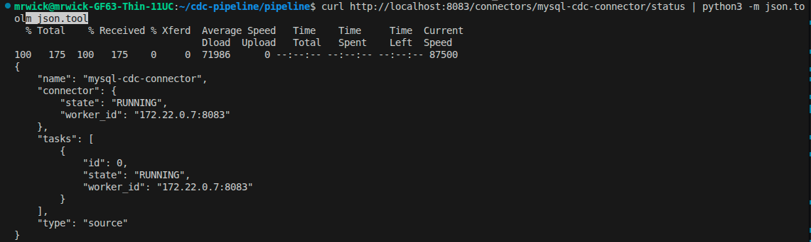
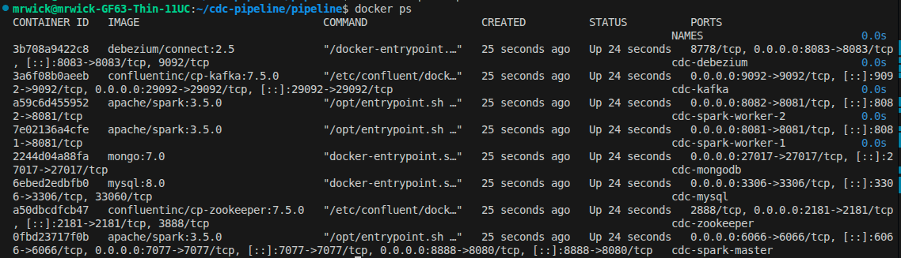

# CDC Pipeline: MySQL → Kafka → Spark → MongoDB

> **Đồ án tốt nghiệp** - Change Data Capture pipeline đồng bộ dữ liệu gần real-time

**Tác giả**: Cao Xuân Phô  
**Trạng thái**: 🟡 POC Phase - Demo từng công cụ một

---

## 📊 Progress Tracker

| Phase | Component | Status | Ngày hoàn thành |
|-------|-----------|--------|-----------------|
| 1 | MySQL 8.0 + Binary Log | ✅ Hoàn thành | 2026-02-24 |
| 2 | MongoDB 7.0 | 🟡 Đang làm | TBD |
| 3 | Kafka + Zookeeper | ⏳ Sắp tới | - |
| 4 | Debezium (MySQL→Kafka) | ⏳ Sắp tới | - |
| 5 | Spark Streaming (Kafka→MongoDB) | ⏳ Sắp tới | - |
| 6 | Full Pipeline Integration | ⏳ Sắp tới | - |
| 7 | Testing & Documentation | ⏳ Sắp tới | - |

---

## 🛠️ Tech Stack

```
MySQL 8.0         → Source database (port 3306)
Debezium 2.5      → CDC connector (port 8083) 
Kafka 7.5.0       → Message broker (port 9092)
Spark 3.5.0       → Stream processing (port 8888)
MongoDB 7.0       → Target database (port 27017)
Docker 29.x       → Containerization
```

---

## 💻 Hệ thống yêu cầu

- **OS**: Linux (Linux Mint 22+, Ubuntu, ...)
- **RAM**: 32GB
- **Disk**: 50GB+ free space
- **Docker**: v29.1.3+
- **Docker Compose**: v5.0.0+

---

## 📋 Quick Start

### Bước 1: Clone repo
```bash
git clone https://github.com/JohnWickCP/cdc-pipeline-mysql-kafka-spark-mongodb.git
cd cdc-pipeline-mysql-kafka-spark-mongodb
```

### Bước 2: Cấu trúc thư mục
```bash
mkdir -p {mysql,mongodb,kafka,spark,debezium,pipeline,screenshots}
```

---

## 🚀 Phase 1: MySQL (✅ Hoàn thành)

### Trạng thái
- ✅ Docker MySQL image đã pull
- ✅ Container chạy (cdc-mysql)
- ✅ Binary Log bật (`--binlog-format=ROW`)
- ✅ Sample data đã insert
- ✅ Test connection thành công

### Docker Compose
```yaml
# mysql/docker-compose.yml
version: '3.8'
services:
  mysql:
    image: mysql:8.0
    container_name: cdc-mysql
    environment:
      MYSQL_ROOT_PASSWORD: root123
      MYSQL_DATABASE: testdb
      MYSQL_USER: cdc_user
      MYSQL_PASSWORD: cdc123
    ports:
      - "3306:3306"
    command:
      - --server-id=1
      - --log-bin=mysql-bin
      - --binlog-format=ROW
      - --binlog-row-image=FULL
```

### Test MySQL
```bash
docker exec -it cdc-mysql mysql -u root -proot123 testdb
> SHOW MASTER STATUS;           # Kiểm tra binlog
> SELECT * FROM orders;         # Xem sample data
```

---

## 🚀 Phase 2: MongoDB (🟡 Đang làm)

### Mục tiêu
- [x] Docker MongoDB image đã pull
- [x] Container chạy (cdc-mongodb)
- [ ] Test kết nối thành công
- [ ] Sample collections tạo thành công
- [ ] Screenshots chụp & commit

### Docker Compose
File: `mongodb/docker-compose.yml`
```yaml
version: '3.8'

services:
  mongodb:
    image: mongo:7.0
    container_name: cdc-mongodb
    environment:
      MONGO_INITDB_ROOT_USERNAME: root
      MONGO_INITDB_ROOT_PASSWORD: root123
      MONGO_INITDB_DATABASE: testdb
    ports:
      - "27017:27017"
    volumes:
      - mongodb_data:/data/db
    restart: unless-stopped
    healthcheck:
      test: echo 'db.adminCommand("ping")' | mongosh --quiet
      interval: 10s
      timeout: 5s
      retries: 5

volumes:
  mongodb_data:
    driver: local
```

### Bước cài đặt & Test

#### Step 1: Cập nhật docker-compose (nếu cần)
```bash
cd ~/cdc-pipeline/mongodb

# Cập nhật file với volume & healthcheck
cat > docker-compose.yml << 'EOF'
version: '3.8'

services:
  mongodb:
    image: mongo:7.0
    container_name: cdc-mongodb
    environment:
      MONGO_INITDB_ROOT_USERNAME: root
      MONGO_INITDB_ROOT_PASSWORD: root123
      MONGO_INITDB_DATABASE: testdb
    ports:
      - "27017:27017"
    volumes:
      - mongodb_data:/data/db
    restart: unless-stopped
    healthcheck:
      test: echo 'db.adminCommand("ping")' | mongosh --quiet
      interval: 10s
      timeout: 5s
      retries: 5

volumes:
  mongodb_data:
    driver: local
EOF

# Restart container
docker compose down
docker compose up -d
```

#### Step 2: Kiểm tra containers chạy
```bash
docker ps
```
**Expected output**: Cả cdc-mysql và cdc-mongodb running

**📸 Screenshot name**: `02-mongodb-running.png`
- Chụp output của `docker ps` show cả MySQL & MongoDB

#### Step 3: Test ping MongoDB
```bash
docker exec -it cdc-mongodb mongosh -u root -p root123 --authenticationDatabase admin testdb --eval "db.adminCommand('ping')"
```
**Expected output**: `{ ok: 1 }`

#### Step 4: Tạo collection & insert data mẫu
```bash
docker exec -it cdc-mongodb mongosh -u root -p root123 --authenticationDatabase admin testdb << 'EOF'
// Tạo collection
db.createCollection('orders')

// Insert sample data
db.orders.insertMany([
  {
    id: 1,
    product: "Laptop",
    quantity: 2,
    price: 1200.00,
    status: "completed",
    created_at: new Date()
  },
  {
    id: 2,
    product: "Mouse",
    quantity: 5,
    price: 25.00,
    status: "pending",
    created_at: new Date()
  },
  {
    id: 3,
    product: "Keyboard",
    quantity: 3,
    price: 75.00,
    status: "completed",
    created_at: new Date()
  }
])

// Hiển thị dữ liệu
print("\n=== Data in orders collection ===")
db.orders.find().pretty()
EOF
```

#### Step 5: Verify dữ liệu
```bash
docker exec -it cdc-mongodb mongosh -u root -p root123 --authenticationDatabase admin testdb --eval "db.orders.find().pretty()"
```

**📸 Screenshot name**: `03-mongodb-sample-data.png`
- Chụp output của lệnh trên, hiển thị 3 records

### Kết quả mong đợi
```javascript
{
  _id: ObjectId('65d4a1f2b8c9d0e1f2g3h4i5'),
  id: 1,
  product: 'Laptop',
  quantity: 2,
  price: 1200,
  status: 'completed',
  created_at: ISODate('2026-02-24T...')
},
{
  _id: ObjectId('65d4a1f2b8c9d0e1f2g3h4i6'),
  id: 2,
  product: 'Mouse',
  quantity: 5,
  price: 25,
  status: 'pending',
  created_at: ISODate('2026-02-24T...')
},
{
  _id: ObjectId('65d4a1f2b8c9d0e1f2g3h4i7'),
  id: 3,
  product: 'Keyboard',
  quantity: 3,
  price: 75,
  status: 'completed',
  created_at: ISODate('2026-02-24T...')
}
```

### Commit GitHub
```bash
cd ~/cdc-pipeline

# Add files
git add mongodb/docker-compose.yml
git add screenshots/02-mongodb-running.png
git add screenshots/03-mongodb-sample-data.png

# Commit
git commit -m "feat(mongodb): add docker-compose with sample data

- MongoDB 7.0 with root credentials
- Volume for data persistence
- Healthcheck configured
- Sample collection 'orders' with 3 test records
- Screenshots: containers running, sample data"

# Push
git push origin main

# Verify
git log --oneline -2
```

---

## Phase 3: Kafka + Zookeeper (Hoàn thành)

Status: Completed

### Mục tiêu
- Zookeeper + Kafka container chạy
- Test topic creation
- Test message producer/consumer
- Screenshots chụp & commit

### Docker Compose
File: `kafka/docker-compose.yml`

```yaml
version: '3.8'

services:
  zookeeper:
    image: confluentinc/cp-zookeeper:7.5.0
    container_name: cdc-zookeeper
    environment:
      ZOOKEEPER_CLIENT_PORT: 2181
      ZOOKEEPER_TICK_TIME: 2000
    ports:
      - "2181:2181"
    restart: unless-stopped
    healthcheck:
      test: echo srvr | nc -w 2 localhost 2181 || exit 1
      interval: 10s
      timeout: 5s
      retries: 5

  kafka:
    image: confluentinc/cp-kafka:7.5.0
    container_name: cdc-kafka
    depends_on:
      zookeeper:
        condition: service_healthy
    environment:
      KAFKA_BROKER_ID: 1
      KAFKA_ZOOKEEPER_CONNECT: zookeeper:2181
      KAFKA_ADVERTISED_LISTENERS: PLAINTEXT://kafka:29092,PLAINTEXT_HOST://localhost:9092
      KAFKA_LISTENER_SECURITY_PROTOCOL_MAP: PLAINTEXT:PLAINTEXT,PLAINTEXT_HOST:PLAINTEXT
      KAFKA_INTER_BROKER_LISTENER_NAME: PLAINTEXT
      KAFKA_OFFSETS_TOPIC_REPLICATION_FACTOR: 1
      KAFKA_AUTO_CREATE_TOPICS_ENABLE: "true"
      KAFKA_DELETE_TOPIC_ENABLE: "true"
    ports:
      - "9092:9092"
      - "29092:29092"
    restart: unless-stopped
    healthcheck:
      test: kafka-broker-api-versions.sh --bootstrap-server localhost:9092 | head -10
      interval: 10s
      timeout: 5s
      retries: 5

  kafka-ui:
    image: provectuslabs/kafka-ui:latest
    container_name: cdc-kafka-ui
    depends_on:
      kafka:
        condition: service_healthy
    environment:
      KAFKA_CLUSTERS_0_NAME: cdc-cluster
      KAFKA_CLUSTERS_0_BOOTSTRAPSERVERS: kafka:29092
      KAFKA_CLUSTERS_0_ZOOKEEPER: zookeeper:2181
    ports:
      - "8080:8080"
    restart: unless-stopped
```

### Bước cài đặt & Test

**Step 1: Tạo kafka/docker-compose.yml**
```bash
cd ~/cdc-pipeline
mkdir -p kafka

cat > kafka/docker-compose.yml << 'EOF'
[paste docker-compose.yml above]
EOF
```

**Step 2: Khởi động Kafka & Zookeeper**
```bash
cd kafka
docker compose up -d
sleep 20
docker ps
```

Expected: cdc-zookeeper, cdc-kafka, cdc-kafka-ui running

**Screenshot**: `04-kafka-running.png`
- Output của `docker ps` show cdc-mysql, cdc-mongodb, cdc-zookeeper, cdc-kafka, cdc-kafka-ui

**Step 3: Tạo topic**
```bash
docker exec cdc-kafka kafka-topics \
  --bootstrap-server localhost:9092 \
  --create \
  --topic test-topic \
  --partitions 1 \
  --replication-factor 1
```

Expected: `Created topic test-topic.`

**Step 4: List topics**
```bash
docker exec cdc-kafka kafka-topics \
  --bootstrap-server localhost:9092 \
  --list
```

Expected: `test-topic`

**Step 5: Test producer (gửi message)**
```bash
echo -e "Hello Kafka\nMessage 2\nMessage 3" | docker exec -i cdc-kafka kafka-console-producer \
  --bootstrap-server localhost:9092 \
  --topic test-topic
```

Expected: Không có output (gửi thành công)

**Step 6: Test consumer (nhận message)**
```bash
timeout 5 docker exec cdc-kafka kafka-console-consumer \
  --bootstrap-server localhost:9092 \
  --topic test-topic \
  --from-beginning
```

Expected output:
```
Hello Kafka
Message 2
Message 3
```

**Screenshot**: `05-kafka-producer-consumer.png`
- Output của Step 5 + 6 (producer + consumer test)

### Commit GitHub
```bash
cd ~/cdc-pipeline

git add kafka/docker-compose.yml
git add screenshots/04-kafka-running.png
git add screenshots/05-kafka-producer-consumer.png

git commit -m "feat(kafka): add zookeeper and kafka broker with delete.topic.enable

- Zookeeper 7.5.0 for coordination
- Kafka 7.5.0 broker with plaintext protocol
- KAFKA_DELETE_TOPIC_ENABLE=true for topic deletion
- Test topic creation and producer/consumer successful
- Screenshots: containers running, producer/consumer test"

git push origin main
```

## 🚀 Phase 4: Debezium (⏳ Sắp tới)

**Mục tiêu**: Kết nối MySQL Binary Log → Kafka topics

**Dự kiến**: Sau Kafka ✅

---

## 🚀 Phase 5: Spark Streaming (⏳ Sắp tới)

**Mục tiêu**: Consume từ Kafka → Xử lý → Ghi MongoDB

**Dự kiến**: Sau Debezium ✅

---

## 📁 Cấu trúc Project

```
cdc-pipeline-mysql-kafka-spark-mongodb/
├── mysql/
│   └── docker-compose.yml          # ✅ Hoàn thành
├── mongodb/
│   └── docker-compose.yml          # 🟡 Đang làm
├── kafka/
│   └── docker-compose.yml          # ⏳ Sắp tới
├── spark/
│   └── docker-compose.yml          # ⏳ Sắp tới
├── debezium/
│   └── docker-compose.yml          # ⏳ Sắp tới
├── pipeline/
│   └── docker-compose.yml          # ⏳ Sắp tới (full tích hợp)
├── screenshots/                     # Chứng minh từng bước
│   ├── 01-mysql-running.png        # ✅
│   └── 02-mongodb-running.png      # 🟡
├── README.md                        # File này
└── .gitignore
```

---

## 📸 Screenshots

| Phase | Screenshot | Mô tả |
|-------|-----------|-------|
| 1 | `01-mysql-running.png` | MySQL container chạy + test data |
| 2 | `02-mongodb-running.png` | MongoDB container chạy + test insert |
| 3 | `03-kafka-running.png` | Kafka + Zookeeper chạy + test topic |
| 4 | `04-debezium-connector.png` | Debezium connector registered |
| 5 | `05-spark-streaming.png` | Spark jobs consuming Kafka |
| 6 | `06-full-pipeline.png` | Data flow MySQL → MongoDB |

---

## 🔧 Lệnh hữu ích

```bash
# Kiểm tra tất cả containers
docker ps -a

# View logs
docker logs <container_name> -f

# Connect vào container
docker exec -it <container_name> bash

# Remove all containers
docker compose down
docker volume prune

# Rebuild images
docker compose up -d --build

# Git status
git status

# Commit changes
git add .
git commit -m "feat: description"
git push origin main
```

---

## 📝 Commit Convention

**Format**: `<type>(<scope>): <subject>`

Examples:
```
feat(mysql): add docker-compose with binlog enabled
feat(mongodb): add docker-compose with healthcheck
fix(kafka): update bootstrap server configuration
docs(readme): add phase 3 instructions
test(debezium): verify connector status endpoint
```

---

## ✅ Checklist - Phase 2 (MongoDB)

- [ ] Docker Compose file tạo
- [ ] Container start thành công
- [ ] Test ping MongoDB → OK
- [ ] Tạo collection 'orders' → OK
- [ ] Insert sample data → OK
- [ ] Screenshot chụp → lưu vào `screenshots/02-mongodb-running.png`
- [ ] Commit lên GitHub → `git push`
- [ ] Update README.md → Mark Phase 2 complete ✅

---

## 📚 References

- [Docker Documentation](https://docs.docker.com/)
- [MongoDB Documentation](https://docs.mongodb.com/)
- [Apache Kafka Documentation](https://kafka.apache.org/documentation/)
- [Debezium Documentation](https://debezium.io/documentation/)
- [Apache Spark Documentation](https://spark.apache.org/docs/)

---

---

## Docker Commands Reference

### Container Management
```bash
# Check containers
docker ps                    # Show running containers
docker ps -a                 # Show all containers

# Logs
docker logs <container_name> -f    # View container logs live

# Stop/Start
docker compose down          # Stop all services
docker compose up -d         # Start all services
docker restart <container>   # Restart container
```

### MongoDB Commands
```bash
# Connect to MongoDB
docker exec cdc-mongodb mongosh -u root -p root123 --authenticationDatabase admin testdb

# Inside mongosh:
db.adminCommand("ping")      # Test connection
show collections             # List collections
db.orders.find().pretty()    # View data
db.orders.countDocuments()   # Count records
exit                         # Exit
```

### MySQL Commands
```bash
# Connect to MySQL
docker exec -it cdc-mysql mysql -u root -proot123 testdb

# Inside MySQL:
SHOW MASTER STATUS;          # Check binlog status
SELECT * FROM orders;        # View data
DESC orders;                 # Table structure
exit                         # Exit
```

### Kafka Commands
```bash
# List topics
docker exec cdc-kafka kafka-topics \
  --bootstrap-server localhost:9092 \
  --list

# Create topic
docker exec cdc-kafka kafka-topics \
  --bootstrap-server localhost:9092 \
  --create \
  --topic <topic-name> \
  --partitions 1 \
  --replication-factor 1

# Delete topic
docker exec cdc-kafka kafka-topics \
  --bootstrap-server localhost:9092 \
  --delete \
  --topic <topic-name>

# Producer (send messages)
echo "message" | docker exec -i cdc-kafka kafka-console-producer \
  --bootstrap-server localhost:9092 \
  --topic <topic-name>

# Consumer (receive messages)
docker exec cdc-kafka kafka-console-consumer \
  --bootstrap-server localhost:9092 \
  --topic <topic-name> \
  --from-beginning
```

### Important Notes
- Use `localhost:9092` for commands inside containers (not `kafka:9092`)
- Use `kafka-topics` (not `kafka-topics.sh`) in Confluent 7.5.0+
- Set `KAFKA_DELETE_TOPIC_ENABLE: "true"` in docker-compose to enable topic deletion

---

## Git Workflow

### Commit Convention
Format: `<type>(<scope>): <subject>`

Types: `feat`, `fix`, `docs`, `test`, `refactor`, `chore`  
Scopes: `mysql`, `mongodb`, `kafka`, `debezium`, `spark`, `readme`, `pipeline`

Examples:
```bash
feat(mongodb): add docker-compose with sample data
fix(kafka): enable topic deletion in docker-compose
docs(readme): update phase 3 completion
```

### Basic Git Commands
```bash
# Check status
git status                   # Show changed files
git log --oneline           # Show commit history

# Add & Commit
git add <file>              # Add single file
git add .                   # Add all changes
git commit -m "message"     # Commit with message

# Push
git push origin main        # Push to GitHub

# Verify
git log --oneline -5        # Show last 5 commits
```

### Typical Workflow per Phase
```bash
# 1. Make changes
# [create/update files]

# 2. Add files
git add <files>

# 3. Commit
git commit -m "feat(<scope>): description"

# 4. Push
git push origin main

# 5. Verify
git log --oneline -2
```

---

## Screenshots

### Phase 1: MySQL

MySQL container + sample data

### Phase 2: MongoDB

MySQL + MongoDB containers


3 records in orders collection

### Phase 3: Kafka

All containers running (MySQL, MongoDB, Zookeeper, Kafka, Kafka-UI)


Producer/Consumer test output

### Phase 4: Debezium (Coming Soon)

Debezium connector running


MySQL connector status OK

### Phase 5: Spark (Coming Soon)

Spark Master + Workers

### Phase 6: Full Pipeline (Coming Soon)

Data flow MySQL → MongoDB

---

## Web UIs

| Service | URL | Port | Purpose |
|---------|-----|------|---------|
| Kafka UI | http://localhost:8080 | 8080 | Monitor Kafka topics |
| Mongo Express | http://localhost:8081 | 8081 | Browse MongoDB data |
| Spark Master | http://localhost:8888 | 8888 | Monitor Spark jobs |
| Debezium REST | http://localhost:8083 | 8083 | Manage connectors |

---

## Troubleshooting

### Topic deletion not working
Problem: `delete.topic.enable=false`  
Solution: Add `KAFKA_DELETE_TOPIC_ENABLE: "true"` to Kafka environment, restart

### MongoDB insert not working
Problem: Heredoc fails with docker exec  
Solution: Use `--eval` flag instead of heredoc

### Kafka commands not found
Problem: `kafka-topics.sh not found`  
Solution: Use `kafka-topics` (without .sh) for Confluent 7.5.0+

### TTY error
Problem: `input device is not a TTY`  
Solution: Remove `-it` flag from docker exec

### Port already in use
Solution:
```bash
sudo lsof -i :<port>      # Find process using port
sudo kill -9 <PID>        # Kill process
```

---

**Last Updated**: 2026-02-24