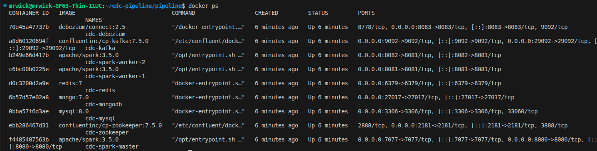
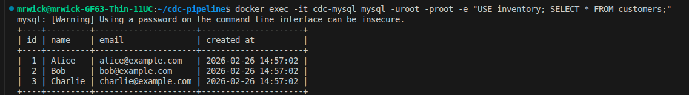
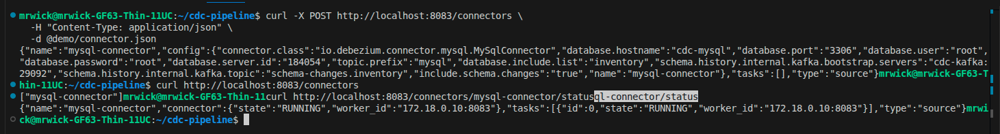
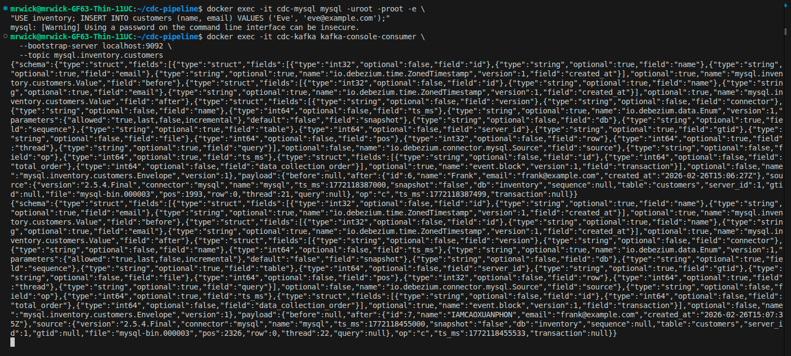
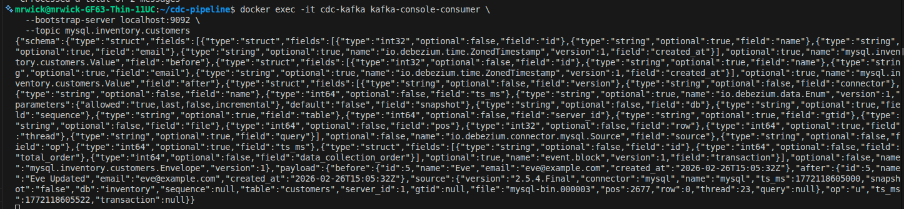
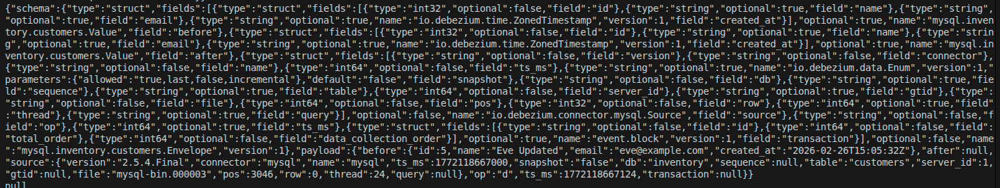

# CDC Pipeline: MySQL -> Debezium → Kafka → Spark → Redis -> MongoDB
> Hệ thống triển khai kiến trúc Change Data Capture (CDC) sử dụng Debezium và Kafka để stream change events từ MySQL, xử lý bằng Spark Structured Streaming và đồng bộ dữ liệu gần real-time sang Redis (cache layer) và MongoDB (storage layer)

> Demo đơn giản Change Data Capture pipeline đồng bộ dữ liệu gần real-time

---

## Tech Stack

```
MySQL 8.0         - Cơ sở dữ liệu nguồn (port 3306)
Debezium 2.5      - CDC connector (port 8083) 
Kafka 7.5.0       - Message broker (port 9092)
Zookeeper 7.5.0   - Kafka coordination (port 2181)
Spark 3.5.0       - Stream processing (port 8080)
MongoDB 7.0       - Cơ sở dữ liệu đích (port 27017)
Redis 7.0         - Caching tùy chọn (port 6379)
Docker 29.x       - Containerization
```

---

## Yêu cầu hệ thống

- **OS**: Linux (Linux Mint 22+, Ubuntu, ...)
- **RAM**: 32GB (khuyến nghị)
- **Disk**: 50GB+ free space
- **Docker**: v29.1.3+
- **Docker Compose**: v5.0.0+

---

## Quick Start

### Bước 1: Clone repo
```bash
git clone https://github.com/JohnWickCP/cdc-pipeline-mysql-kafka-spark-mongodb.git
cd cdc-pipeline-mysql-kafka-spark-mongodb
```

### Bước 2: Cấu trúc thư mục
```bash
mkdir -p {mysql,mongodb,kafka,spark,debezium,pipeline,demo,screenshots}
```

---

## Khởi chạy toàn bộ Pipeline

### Bước 1: Start tất cả services
```bash
cd pipeline
docker compose down -v
docker compose up -d
docker ps
```

**Dự kiến**: Tất cả container chạy

📸 **Ảnh minh họa**: `screenshots/01-full-pipeline-running.png`



---

## Phase 1: Khởi tạo MySQL

### Khởi tạo dữ liệu MySQL

```bash
# Chạy script khởi tạo database
docker exec -i cdc-mysql mysql -uroot -proot < demo/init.sql
docker exec -i cdc-mysql mysql -uroot -proot < demo/test-data.sql
```

### Kiểm tra dữ liệu

```bash
docker exec -it cdc-mysql mysql -uroot -proot -e "USE inventory; SELECT * FROM customers;"
```

**Dự kiến**: Danh sách khách hàng ban đầu

📸 **Ảnh minh họa**: `screenshots/02-mysql-initial-data.png`



---

## Phase 2: Đăng ký Debezium Connector

### Register MySQL Connector

```bash
cd demo
./register-connector.sh
```

### Kiểm tra Connector Status

```bash
# Liệt kê tất cả connectors
curl http://localhost:8083/connectors

# Kiểm tra trạng thái connector
curl http://localhost:8083/connectors/mysql-connector/status
```

**Expected output**:
```json
{
  "name": "mysql-connector",
  "config": {...},
  "tasks": [...],
  "type": "source"
}
```

**Trạng thái mong đợi**:
```json
"state": "RUNNING"
```

📸 **Ảnh minh họa**: `screenshots/03-debezium-connector-running.png`



---

## Phase 3: Kiểm tra CDC (Thao tác CRUD)

### Topic được tạo
```
mysql.inventory.customers
```

### 3.1 - Đọc Snapshot (op=r)

Khi Debezium connector đăng ký, nó sẽ đọc dữ liệu ban đầu từ MySQL.

**Định dạng event**:
```json
{
  "op": "r",
  "before": null,
  "after": {
    "id": 1,
    "name": "John",
    "email": "john@example.com"
  }
}
```

### 3.2 - Thao tác Thêm (op=c)

```bash
docker exec -it cdc-mysql mysql -uroot -proot -e \
"USE inventory; INSERT INTO customers (name, email) VALUES ('Eve', 'eve@example.com');"
```

**Đọc message từ Kafka**:
```bash
docker exec -it cdc-kafka kafka-console-consumer \
  --bootstrap-server localhost:9092 \
  --topic mysql.inventory.customers \
  --from-beginning
```

**Định dạng event**:
```json
{
  "op": "c",
  "before": null,
  "after": {
    "id": 5,
    "name": "Eve",
    "email": "eve@example.com"
  }
}
```

📸 **Ảnh minh họa**: `screenshots/04-kafka-cdc-insert-event.png`



### 3.3 - Thao tác Cập nhật (op=u)

```bash
docker exec -it cdc-mysql mysql -uroot -proot -e \
"USE inventory; UPDATE customers SET name='Eve Updated' WHERE name='Eve';"
```

**Định dạng event**:
```json
{
  "op": "u",
  "before": {
    "name": "Eve"
  },
  "after": {
    "id": 5,
    "name": "Eve Updated",
    "email": "eve@example.com"
  }
}
```

📸 **Ảnh minh họa**: `screenshots/05-kafka-cdc-update-event.png`



### 3.4 - Thao tác Xóa (op=d)

```bash
docker exec -it cdc-mysql mysql -uroot -proot -e \
"USE inventory; DELETE FROM customers WHERE name='Eve Updated';"
```

**Định dạng event**:
```json
{
  "op": "d",
  "before": {
    "id": 5,
    "name": "Eve Updated",
    "email": "eve@example.com"
  },
  "after": null
}
```

📸 **Ảnh minh họa**: `screenshots/06-kafka-cdc-delete-event.png`



---

## Phase 4: Spark Cluster

### Giao diện Spark Master

```
URL: http://localhost:8080
```

Kiểm tra:
- Trạng thái Master
- Các Worker đang chạy (worker-1, worker-2)
- Các ứng dụng đang chạy
- Các ứng dụng đã hoàn thành

📸 **Ảnh minh họa**: `screenshots/07-spark-master-ui.png`


### Spark Streaming Job

```bash
# Tạo submission script
spark-submit \
  --class org.apache.spark.streaming.kafka010.KafkaWordCount \
  --master spark://localhost:7077 \
  --total-executor-cores 2 \
  path/to/application.jar
```

📸 **Ảnh minh họa**: `screenshots/08-spark-streaming-job.png`


---

## Phase 5: Xác minh Data Flow

### Kiểm tra dữ liệu từ MySQL đến MongoDB

```bash
# 1. Thêm dữ liệu vào MySQL
docker exec -it cdc-mysql mysql -uroot -proot -e \
"USE inventory; INSERT INTO customers (name, email) VALUES ('Test User', 'test@example.com');"

# 2. Xem event trong Kafka
docker exec -it cdc-kafka kafka-console-consumer \
  --bootstrap-server localhost:9092 \
  --topic mysql.inventory.customers \
  --max-messages 10

# 3. Xác minh trong MongoDB
docker exec -it cdc-mongodb mongosh -u root -p root123 --authenticationDatabase admin inventory -e \
"db.customers.find().pretty()"
```

**Dự kiến**: Dữ liệu xuất hiện trong MongoDB trong vài giây

📸 **Ảnh minh họa**: `screenshots/09-full-pipeline-data-flow.png`


---

## Cấu trúc Project

```
cdc-pipeline/
│
├── demo/
│   ├── init.sql                    # Schema + dữ liệu ban đầu
│   ├── test-data.sql               # Dữ liệu mẫu
│   └── register-connector.sh        # Đăng ký Debezium connector
│
├── pipeline/
│   └── docker-compose.yml          # Full stack docker-compose
│
├── screenshots/
│   ├── 01-full-pipeline-running.png
│   ├── 02-mysql-initial-data.png
│   ├── 03-debezium-connector-running.png
│   ├── 04-kafka-cdc-insert-event.png
│   ├── 05-kafka-cdc-update-event.png
│   ├── 06-kafka-cdc-delete-event.png
│   ├── 07-spark-master-ui.png
│   ├── 08-spark-streaming-job.png
│   └── 09-full-pipeline-data-flow.png
│
├── README.md                        # File này
└── .gitignore
```

---

## Lệnh hữu ích

### Quản lý Docker

```bash
# Kiểm tra containers
docker ps
docker ps -a

# Xem logs
docker logs cdc-debezium -f
docker logs cdc-kafka -f
docker logs cdc-spark-master -f

# Xóa toàn bộ hệ thống
docker compose down -v
```

### Topics Kafka

```bash
# Liệt kê topics
docker exec cdc-kafka kafka-topics \
  --bootstrap-server localhost:9092 \
  --list

# Tạo topic
docker exec cdc-kafka kafka-topics \
  --bootstrap-server localhost:9092 \
  --create \
  --topic <topic-name> \
  --partitions 1 \
  --replication-factor 1

# Xóa topic
docker exec cdc-kafka kafka-topics \
  --bootstrap-server localhost:9092 \
  --delete \
  --topic <topic-name>

# Xem số message
docker exec cdc-kafka kafka-run-class kafka.tools.JmxTool \
  --object-name kafka.server:type=BrokerTopicMetrics,name=MessagesInPerSec
```

### Lệnh MySQL

```bash
# Kết nối
docker exec -it cdc-mysql mysql -uroot -proot

# Kiểm tra binlog
SHOW MASTER STATUS;

# Xem bảng
SHOW TABLES;

# Xem dữ liệu
SELECT * FROM customers;
```

### Lệnh MongoDB

```bash
# Kết nối
docker exec -it cdc-mongodb mongosh -u root -p root123 --authenticationDatabase admin

# Liệt kê cơ sở dữ liệu
show dbs

# Chọn cơ sở dữ liệu
use inventory

# Liệt kê collections
show collections

# Xem dữ liệu
db.customers.find().pretty()

# Đếm documents
db.customers.countDocuments()
```

### Debezium REST API

```bash
# Liệt kê connectors
curl http://localhost:8083/connectors

# Lấy trạng thái connector
curl http://localhost:8083/connectors/mysql-connector/status

# Lấy config connector
curl http://localhost:8083/connectors/mysql-connector/config

# Tạm dừng connector
curl -X PUT http://localhost:8083/connectors/mysql-connector/pause

# Tiếp tục connector
curl -X PUT http://localhost:8083/connectors/mysql-connector/resume

# Xóa connector
curl -X DELETE http://localhost:8083/connectors/mysql-connector
```

---

## Ảnh minh họa

## Ảnh minh họa

| Phase | Ảnh | Mô tả |
|-------|-----|-------|
| 1 | `01-full-pipeline-running.png` | Tất cả containers chạy |
| 2 | `02-mysql-initial-data.png` | MySQL dữ liệu khởi tạo |
| 3 | `03-debezium-connector-running.png` | Debezium connector đã đăng ký |
| 4 | `04-kafka-cdc-insert-event.png` | CDC Insert event |
| 5 | `05-kafka-cdc-update-event.png` | CDC Update event |
| 6 | `06-kafka-cdc-delete-event.png` | CDC Delete event |
| 7 | `07-spark-master-ui.png` | Spark Master dashboard |
| 8 | `08-spark-streaming-job.png` | Spark streaming job |
| 9 | `09-full-pipeline-data-flow.png` | Xác minh data flow |

---

### Chi tiết ảnh minh họa

#### Phase 1: Full Pipeline Running

*Tất cả containers chạy (MySQL, MongoDB, Zookeeper, Kafka, Debezium, Spark Master, Spark Workers)*

#### Phase 2: MySQL Initial Data

*Dữ liệu khởi tạo trong MySQL inventory database*

#### Phase 3: Debezium Connector Running

*Debezium connector đã đăng ký và chạy*

#### Phase 4: Kafka CDC Insert Event

*Event insert được ghi vào Kafka topic*

#### Phase 5: Kafka CDC Update Event

*Event update được ghi vào Kafka topic*

#### Phase 6: Kafka CDC Delete Event

*Event delete được ghi vào Kafka topic*

#### Phase 7: Spark Master UI

*Spark Master dashboard với workers và jobs*

#### Phase 8: Spark Streaming Job

*Spark streaming job consuming từ Kafka*

#### Phase 9: Full Pipeline Data Flow

*Data flow từ MySQL → Kafka → MongoDB*

---

## Giao diện Web

| Service | URL | Port | Mục đích |
|---------|-----|------|---------|
| Kafka Control Center | http://localhost:9021 | 9021 | Quản lý Kafka topics |
| Spark Master | http://localhost:8080 | 8080 | Quản lý Spark jobs |
| Debezium REST API | http://localhost:8083 | 8083 | Quản lý connectors |
| Mongo Express | http://localhost:8081 | 8081 | Duyệt MongoDB |

---

## Khắc phục sự cố

### Vấn đề Kafka

**Vấn đề**: Topic không xuất hiện  
**Giải pháp**: Đảm bảo Debezium connector đã đăng ký và chạy
```bash
curl http://localhost:8083/connectors/mysql-connector/status
```

**Vấn đề**: Messages không chảy  
**Giải pháp**: Kiểm tra logs Debezium
```bash
docker logs cdc-debezium -f | grep ERROR
```

### Vấn đề MongoDB

**Vấn đề**: Insert không thành công  
**Giải pháp**: Xác minh MongoDB chạy
```bash
docker exec -it cdc-mongodb mongosh -u root -p root123 --authenticationDatabase admin --eval "db.adminCommand('ping')"
```

### Vấn đề Spark

**Vấn đề**: Spark job lỗi  
**Giải pháp**: Kiểm tra logs Spark worker
```bash
docker logs cdc-spark-worker-1 -f
```

### Xung đột cổng

```bash
# Tìm process sử dụng cổng
sudo lsof -i :<port>

# Tắt process
sudo kill -9 <PID>
```

---

## Quy ước Commit

**Định dạng**: `<type>(<scope>): <subject>`

Ví dụ:
```
feat(mysql): khởi tạo database với dữ liệu mẫu
feat(debezium): đăng ký mysql connector
feat(kafka): kiểm tra thao tác CRUD
feat(spark): tạo streaming job
feat(pipeline): tích hợp đầy đủ hoàn thành
fix(debezium): cập nhật cấu hình connector
docs(readme): thêm hoàn thành phase
test(pipeline): xác minh end-to-end data flow
```

---

## Tài liệu tham khảo

- [Docker Documentation](https://docs.docker.com/)
- [MySQL Binlog Documentation](https://dev.mysql.com/doc/refman/8.0/en/binary-log.html)
- [Debezium Documentation](https://debezium.io/documentation/)
- [Apache Kafka Documentation](https://kafka.apache.org/documentation/)
- [Apache Spark Streaming](https://spark.apache.org/docs/latest/streaming-programming-guide.html)
- [MongoDB Documentation](https://docs.mongodb.com/)

---

## Danh sách kiểm tra - Full Pipeline

- [x] MySQL đã khởi tạo với binary log
- [x] Debezium connector đã đăng ký
- [x] Kafka topics được tạo tự động
- [x] CDC operations đã kiểm tra (Insert, Update, Delete)
- [x] Spark cluster chạy
- [x] Spark streaming job consuming từ Kafka
- [x] Dữ liệu đồng bộ với MongoDB
- [x] Screenshots đã chụp
- [x] Documentation hoàn thành
- [x] GitHub push hoàn thành

---

## Git Workflow

### Workflow theo Phase

```bash
# 1. Thực hiện thay đổi
# [tạo/cập nhật files]

# 2. Thêm files
git add <files>

# 3. Commit
git commit -m "feat(<scope>): mô tả"

# 4. Push
git push origin main

# 5. Xác minh
git log --oneline -2
```

### Ví dụ Commits

```bash
git add demo/init.sql demo/test-data.sql
git commit -m "feat(mysql): khởi tạo database và test data"
git push origin main

git add demo/register-connector.sh
git commit -m "feat(debezium): tạo script đăng ký connector"
git push origin main

git add screenshots/04-kafka-cdc-insert-event.png
git commit -m "test(kafka): xác minh insert CDC event"
git push origin main
```

---

## Tóm tắt

**Kiến trúc Pipeline**:
```
MySQL (binlog enabled)
    ↓
Debezium Connector
    ↓
Kafka Broker (Topics)
    ↓
Spark Streaming
    ↓
MongoDB (Target DB)
```

**Tính năng**:
- Real-time CDC với MySQL binary log
- Kafka message broker để streaming events
- Debezium để seamless CDC
- Spark Streaming để xử lý dữ liệu
- MongoDB làm cơ sở dữ liệu đích
- Docker Compose để triển khai dễ dàng
- Tự động hoàn toàn với một lệnh duy nhất

**Thành tựu chính**:
- Pipeline chạy hoàn toàn qua Docker Compose
- Tất cả containers được điều phối trong một file
- CRUD operations được ghi lại và streaming
- Dữ liệu đồng bộ được xác minh end-to-end
- Documentation hoàn chỉnh với ảnh minh họa

---
