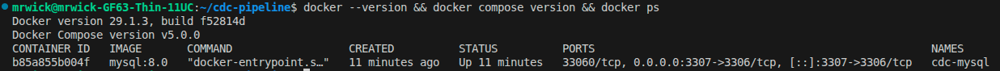

# CDC Pipeline: MySQL → Debezium → Kafka → Spark Streaming → MongoDB

> Đồ án tốt nghiệp - Xây dựng pipeline Change Data Capture (CDC) đồng bộ dữ liệu gần thời gian thực từ MySQL sang MongoDB sử dụng Kafka và Spark Streaming.

---

## 📌 Tổng quan

Pipeline này giải quyết bài toán đồng bộ dữ liệu giữa hệ thống giao dịch (OLTP - MySQL) và hệ thống đọc tốc độ cao (MongoDB) với độ trễ dưới 10 giây, thay thế cho phương pháp Batch ETL truyền thống.

```
MySQL → Debezium → Kafka → Spark Streaming → MongoDB
```

---

## 🛠️ Tech Stack

| Công nghệ | Version | Vai trò |
|-----------|---------|---------|
| MySQL | 8.0 | Source database (OLTP) |
| Debezium | 2.x | CDC connector - đọc Binary Log |
| Apache Kafka | 3.x | Message broker |
| Apache Spark | 3.x | Stream processing (PySpark) |
| MongoDB | 7.x | Target database (Read-optimized) |
| Docker | 29.x | Container runtime |
| Docker Compose | v5.x | Multi-container orchestration |

---

## 💻 Môi trường

- OS: Linux Mint 22.2 (Zara) — Ubuntu Noble base
- RAM: 32GB
- Docker: 29.1.3
- Docker Compose: v5.0.0

---

## 📋 Yêu cầu trước khi cài đặt (Prerequisites)

- Đã cài **Docker** và **Docker Compose**
- RAM tối thiểu 16GB (khuyến nghị 32GB+)
- Git đã được cấu hình

Kiểm tra Docker:
```bash
docker --version
docker compose version
```

---

## 🚀 Cài đặt từng bước

### Bước 1 — Clone repo

```bash
git clone https://github.com/JohnWickCP/cdc-pipeline-mysql-kafka-spark-mongodb.git
cd cdc-pipeline-mysql-kafka-spark-mongodb
```

---

### Bước 2 — MySQL

MySQL được cấu hình với **Binary Log (binlog)** bật sẵn — đây là điều kiện bắt buộc để Debezium có thể đọc các thay đổi dữ liệu (CDC).

```bash
cd mysql
docker compose up -d
```

Kiểm tra container đang chạy:
```bash
docker ps
```

Kết nối vào MySQL và test:
```bash
docker exec -it cdc-mysql mysql -u root -proot123 testdb
```

Tạo bảng và insert data mẫu:
```sql
CREATE TABLE orders (
  id INT AUTO_INCREMENT PRIMARY KEY,
  product VARCHAR(100),
  quantity INT,
  created_at TIMESTAMP DEFAULT CURRENT_TIMESTAMP
);

INSERT INTO orders (product, quantity) VALUES ('Laptop', 2);
INSERT INTO orders (product, quantity) VALUES ('Mouse', 5);

SELECT * FROM orders;
```

> **Lưu ý:** Nếu port 3306 đã bị chiếm (MySQL cài sẵn trên máy), container sẽ dùng port **3307** thay thế.

📸 Kết quả:


---

### Bước 3 — MongoDB

```bash
cd ../mongodb
docker compose up -d
```

*(Hướng dẫn chi tiết sẽ cập nhật sau)*

---

### Bước 4 — Kafka

```bash
cd ../kafka
docker compose up -d
```

*(Hướng dẫn chi tiết sẽ cập nhật sau)*

---

### Bước 5 — Spark

```bash
cd ../spark
docker compose up -d
```

*(Hướng dẫn chi tiết sẽ cập nhật sau)*

---

### Bước 6 — Debezium

```bash
cd ../debezium
docker compose up -d
```

*(Hướng dẫn chi tiết sẽ cập nhật sau)*

---

### Bước 7 — Full Pipeline

```bash
cd ../pipeline
docker compose up -d
```

*(Hướng dẫn chi tiết sẽ cập nhật sau)*

---

## 📁 Cấu trúc thư mục

```
cdc-pipeline/
├── mysql/                  # MySQL 8.0 + binlog config
│   └── docker-compose.yml
├── mongodb/                # MongoDB 7.x
│   └── docker-compose.yml
├── kafka/                  # Kafka + Zookeeper
│   └── docker-compose.yml
├── spark/                  # Apache Spark (PySpark)
│   └── docker-compose.yml
├── debezium/               # Debezium CDC connector
│   └── docker-compose.yml
├── pipeline/               # Full pipeline tích hợp
│   └── docker-compose.yml
├── screenshots/            # Ảnh minh hoạ từng bước
└── README.md
```

---

## 📸 Screenshots

| Bước | Mô tả | Ảnh |
|------|-------|-----|
| 00 | Docker version |  |
| 01 | MySQL chạy trong Docker |  |

*(Cập nhật thêm sau mỗi bước)*

---

## 📝 Ghi chú

- Pipeline được thiết kế chạy trên môi trường **local Docker**, không yêu cầu cloud
- Spark trigger interval: **5 giây** → End-to-end latency mục tiêu: **< 10 giây**
- PII Masking được thực hiện trên Spark (email, phone) trước khi ghi vào MongoDB

---

- GitHub: [@JohnWickCP](https://github.com/JohnWickCP)